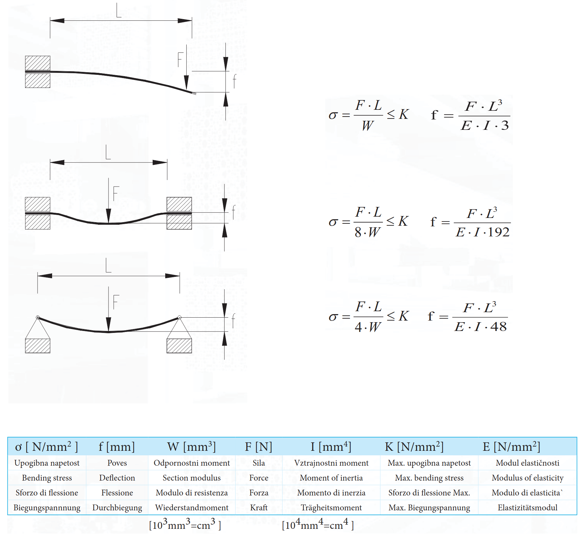

---  
share: true  
tag: public  
---  
# Beam load calculations  
  
  
## Section modulus  
 is a geometric property for a given cross-section used in the design of beams or flexural members. Other geometric properties used in design include area for tension, radius of gyration for compression, and moment of inertia for stiffness. Any relationship between these properties is highly dependent on the shape in question. Usually denoted as   
$$W_(xyz)$$  
  
  
The elastic section modulus is defined as   
$$W_x = I_x / y$$  
, where I is the second moment of area (or moment of inertia) and y is the distance from the neutral axis to any given fiber. It is often reported using y = c, where c is the distance from the neutral axis to the most extreme fiber.  
  
It is also often used to determine the yield moment such that  
$$ M_y = Sσ_y$$  
, where σy is the yield strength of the material.  
  
### Moment of inertia and Section Modulus of a  Hollow Rectangle Square  
  
  
$$ I_x = {BH^3 \over 12} - {bh^3 \over 12} $$  
$$ W_x = {BH^2 \over 6} - {bh^3 \over 6H} $$  
  
  
  
## Load calculations  
  
  
