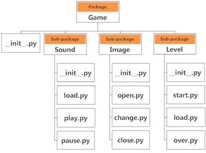

---  
share: true  
tag: public  
---  
# Python importing  
Relative imports can only be used when script is invoked as a package/module i.e.: if we have example.py you can use relative imports in it only if:  
    - it is going to be imported from elsewhere as `import example`  
    - it is invoked as a module: `python -m package.example`  
  
## [Ultimate explanation](https://stackoverflow.com/questions/14132789/relative-imports-for-the-billionth-time/14132912#14132912):  
**Script vs. Module**  
  
Here's an explanation. The short version is that there is a big difference between directly running a Python file, and importing that file from somewhere else. **Just knowing what directory a file is in does not determine what package Python thinks it is in.** That depends, additionally, on how you load the file into Python (by running or by importing).  
  
There are two ways to load a Python file: as the top-level script, or as a module. A file is loaded as the top-level script if you execute it directly, for instance by typing `python myfile.py` on the command line. It is loaded as a module when an `import` statement is encountered inside some other file. There can only be one top-level script at a time; the top-level script is the Python file you ran to start things off.  
  
**Naming**  
  
When a file is loaded, it is given a name (which is stored in its `__name__` attribute).  
  
-   If it was loaded as the top-level script, its name is `__main__`.  
-   If it was loaded as a module, its name is \[ the filename, preceded by the names of any packages/subpackages of which it is a part, separated by dots \], for example, `package.subpackage1.moduleX`.  
  
But be aware, if you load `moduleX` as a module from shell command line using something like `python -m package.subpackage1.moduleX`, the `__name__` will still be `__main__`.  
  
So for instance in your example:  
  
```  
package/  
    __init__.py  
    subpackage1/  
        __init__.py  
        moduleX.py  
    moduleA.py  
```  
  
if you imported `moduleX` (note: _imported_, not directly executed), its name would be `package.subpackage1.moduleX`. If you imported `moduleA`, its name would be `package.moduleA`. However, if you _directly run_ `moduleX` from the command line, its name will instead be `__main__`, and if you directly run `moduleA` from the command line, its name will be `__main__`. When a module is run as the top-level script, it loses its normal name and its name is instead `__main__`.  
  
**Accessing a module NOT through its containing package**  
  
There is an additional wrinkle: the module's name depends on whether it was imported "directly" from the directory it is in or imported via a package. This only makes a difference if you run Python in a directory, and try to import a file in that same directory (or a subdirectory of it). For instance, if you start the Python interpreter in the directory `package/subpackage1` and then do `import moduleX`, the name of `moduleX` will just be `moduleX`, and not `package.subpackage1.moduleX`. This is because Python adds the current directory to its search path when the interpreter is entered interactively; if it finds the to-be-imported module in the current directory, it will not know that that directory is part of a package, and the package information will not become part of the module's name.  
  
A special case is if you run the interpreter interactively (e.g., just type `python` and start entering Python code on the fly). In this case, the name of that interactive session is `__main__`.  
  
Now here is the crucial thing for your error message: **if a module's name has no dots, it is not considered to be part of a package**. It doesn't matter where the file actually is on disk. All that matters is what its name is, and its name depends on how you loaded it.  
  
Now look at the quote you included in your question:  
  
> Relative imports use a module's name attribute to determine that module's position in the package hierarchy. If the module's name does not contain any package information (e.g. it is set to 'main') then relative imports are resolved as if the module were a top-level module, regardless of where the module is actually located on the file system.  
  
**Relative imports...**  
  
Relative imports use the module's _name_ to determine where it is in a package. When you use a relative import like `from .. import foo`, the dots indicate to step up some number of levels in the package hierarchy. For instance, if your current module's name is `package.subpackage1.moduleX`, then `..moduleA` would mean `package.moduleA`. For a `from .. import` to work, the module's name must have at least as many dots as there are in the `import` statement.  
  
**... are only relative in a package**  
  
However, if your module's name is `__main__`, it is not considered to be in a package. Its name has no dots, and therefore you cannot use `from .. import` statements inside it. If you try to do so, you will get the "relative-import in non-package" error.  
  
**Scripts can't import relative**  
  
What you probably did is you tried to run `moduleX` or the like from the command line. When you did this, its name was set to `__main__`, which means that relative imports within it will fail, because its name does not reveal that it is in a package. Note that this will also happen if you run Python from the same directory where a module is, and then try to import that module, because, as described above, Python will find the module in the current directory "too early" without realizing it is part of a package.  
  
Also remember that when you run the interactive interpreter, the "name" of that interactive session is always `__main__`. Thus **you cannot do relative imports directly from an interactive session**. Relative imports are only for use within module files.  
  
**Two solutions:**  
  
1.  If you really do want to run `moduleX` directly, but you still want it to be considered part of a package, you can do `python -m package.subpackage1.moduleX`. The `-m` tells Python to load it as a module, not as the top-level script.  
      
2.  Or perhaps you don't actually want to _run_ `moduleX`, you just want to run some other script, say `myfile.py`, that _uses_ functions inside `moduleX`. If that is the case, put `myfile.py` _somewhere else_ – _not_ inside the `package` directory – and run it. If inside `myfile.py` you do things like `from package.moduleA import spam`, it will work fine.  
      
  
**Notes**  
  
-   For either of these solutions, the package directory (`package` in your example) must be accessible from the Python module search path (`sys.path`). If it is not, you will not be able to use anything in the package reliably at all.  
      
-   Since Python 2.6, the module's "name" for package-resolution purposes is determined not just by its `__name__` attributes but also by the `__package__` attribute. That's why I'm avoiding using the explicit symbol `__name__` to refer to the module's "name". Since Python 2.6 a module's "name" is effectively `__package__ + '.' + __name__`, or just `__name__` if `__package__` is `None`.)  
  
  
## [Python Package](https://www.programiz.com/python-programming/package)  
  
In this article, you'll learn to divide your code base into clean, efficient modules using Python packages. Also, you'll learn to import and use your own or third party packages in a Python program.  
  
## Video: Python Packages: Organize Your Code  
  
  
## What are packages?  
  
We don't usually store all of our files on our computer in the same location. We use a well-organized hierarchy of directories for easier access.  
  
Similar files are kept in the same directory, for example, we may keep all the songs in the "**music**" directory. Analogous to this, Python has packages for directories and [modules](https://www.programiz.com/python-programming/modules) for files.  
  
As our application program grows larger in size with a lot of modules, we place similar modules in one package and different modules in different packages. This makes a project (program) easy to manage and conceptually clear.  
  
Similarly, as a directory can contain subdirectories and files, a Python package can have sub-packages and modules.  
  
A directory must contain a file named `__init__.py` in order for Python to consider it as a package. This file can be left empty but we generally place the initialization code for that package in this file.  
  
Here is an example. Suppose we are developing a game. One possible organization of packages and modules could be as shown in the figure below.  
  
  
  
Package Module Structure in Python Programming  
  
___  
  
## Importing module from a package  
  
We can import modules from packages using the dot (.) operator.  
  
For example, if we want to import the `start` module in the above example, it can be done as follows:  
  
```  
import Game.Level.start  
```  
  
Now, if this module contains a [function](https://www.programiz.com/python-programming/function) named `select_difficulty()`, we must use the full name to reference it.  
  
```  
Game.Level.start.select_difficulty(2)  
```  
  
If this construct seems lengthy, we can import the module without the package prefix as follows:  
  
```  
from Game.Level import start  
```  
  
We can now call the function simply as follows:  
  
```  
start.select_difficulty(2)  
```  
  
Another way of importing just the required function (or class or variable) from a module within a package would be as follows:  
  
```  
from Game.Level.start import select_difficulty  
```  
  
Now we can directly call this function.  
  
```  
select_difficulty(2)  
```  
  
Although easier, this method is not recommended. Using the full [namespace](https://www.programiz.com/python-programming/namespace) avoids confusion and prevents two same identifier names from colliding.  
  
While importing packages, Python looks in the list of directories defined in `sys.path`, similar as for [module search path](https://www.programiz.com/python-programming/modules#search).  
