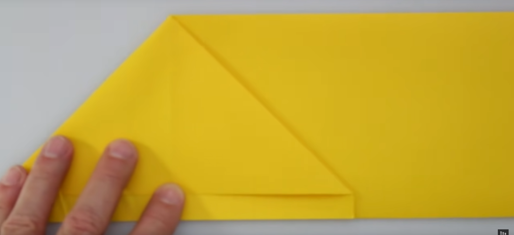

---  
share: true  
tag: public  
---  
# Super Canard  
  
## Description  
- build complexity: Very high  
- throwing skill required: Very low  
- best throw style: any  
- best for: stall resistance and robustness  
    
## Info  
[Build intructions](https://www.youtube.com/watch?v=38ZpBSjxyDo)  
  
  
https://www.youtube.com/watch?v=j28yB_0Ut1k  
## Instruction  
- [ ] write instructions 🔽   
  
1. Fold the short edge in half  
      
2. Fold one side to a third of the width to get 2 equal parts (approximate)  
      
3. Rotate 180 degrees so the open part of the fold is facing you and make a squash fold.  
      
4. Put the triange on the table and have the long part in the air. Make a squash fold on it a as well and then rotate it. so the new squash is on the table. You get something similar to the water bomb base but not well aligned  
  
  
  
5. Now squash fold both of the flaps. Aligh squash with the corner of the flaps.  
  
6. Now squash fold both of the back flaps. This time aligh squash fold with the already made crease  
  
7. Unfold the half crease and turn around.