---  
share: true  
tag: public  
---  
# Suzzane  
  
## Description  
- build complexity: low  
- throwing skill required: medium  
- best throw style: javelin  
- best for: distance  
  
## Info  
Made world record in paper airplane distance. Glides very nicely even if thrown like javelin with force.  
  
[Build instructions](https://www.youtube.com/watch?v=KTTIM903eEk&t=197s)  
[Detailed build instructions](https://www.youtube.com/watch?v=B-RUB-qNQ4g)  
  
## Instructions  
Use A4 paper  
1. Make a triangle fold (as if you wanted to make a square paper) on both sides  
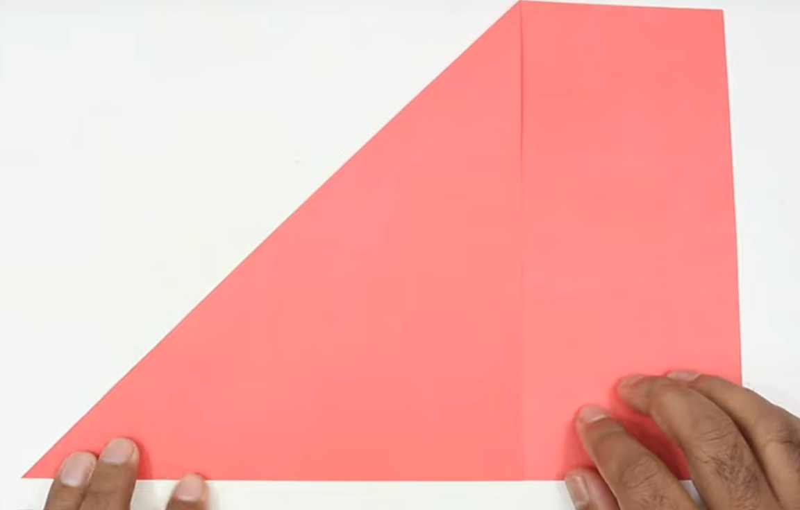  
  
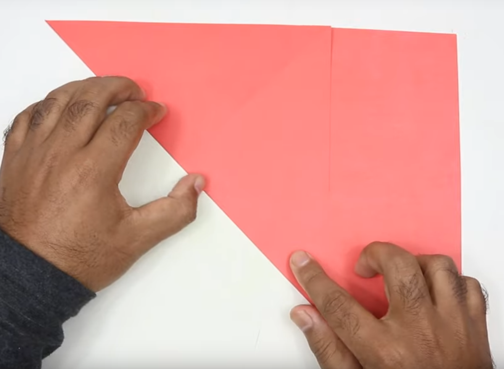  
  
2. The result should be a cross  
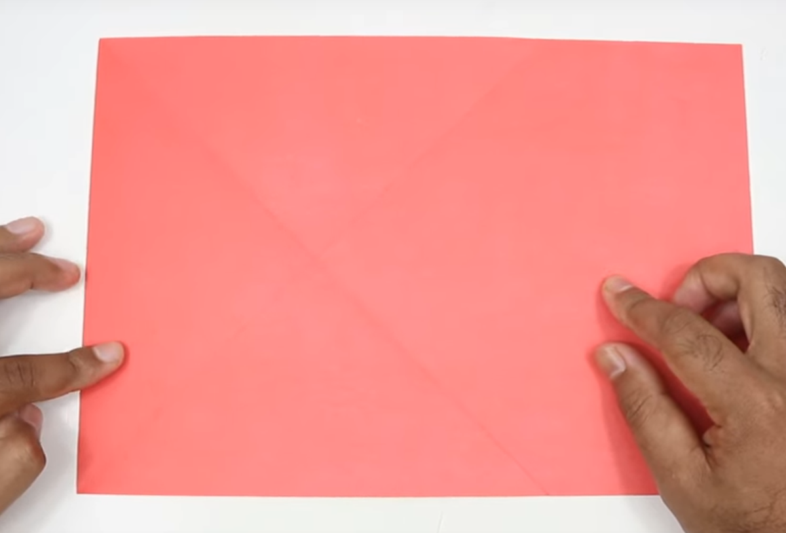  
  
3. Then fold corners to the lines acquired so far on both sides  
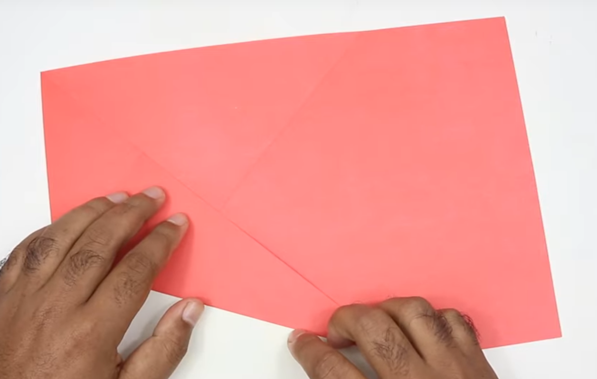  
  
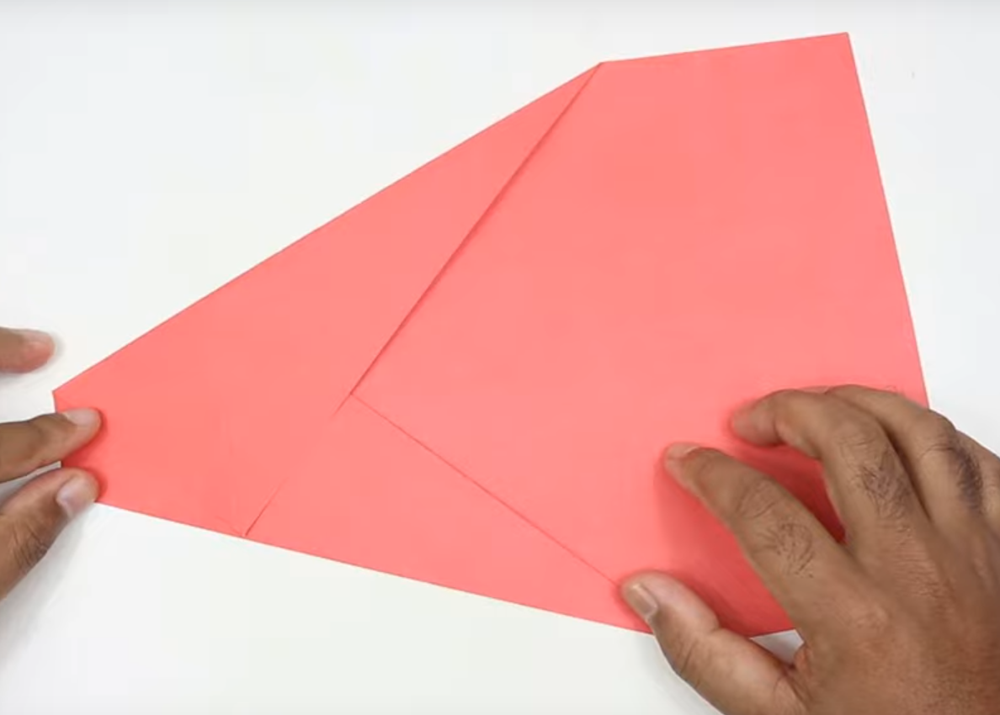  
  
4. fold down the tapered top at the intersection of layers  
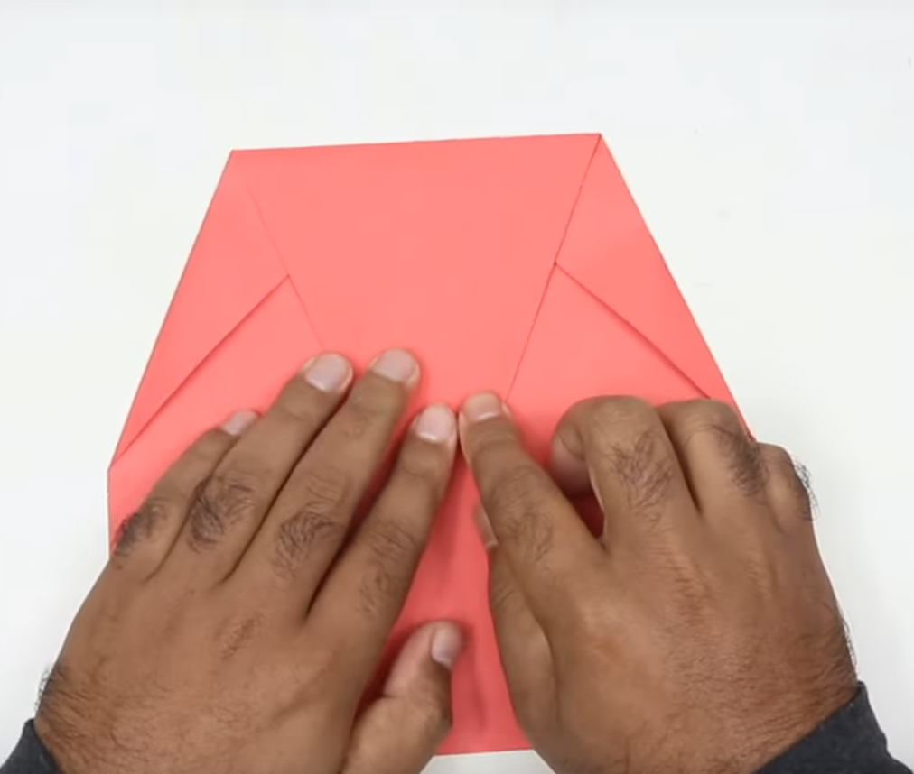  
  
5. Fold on the already folded lines to make an arrow  
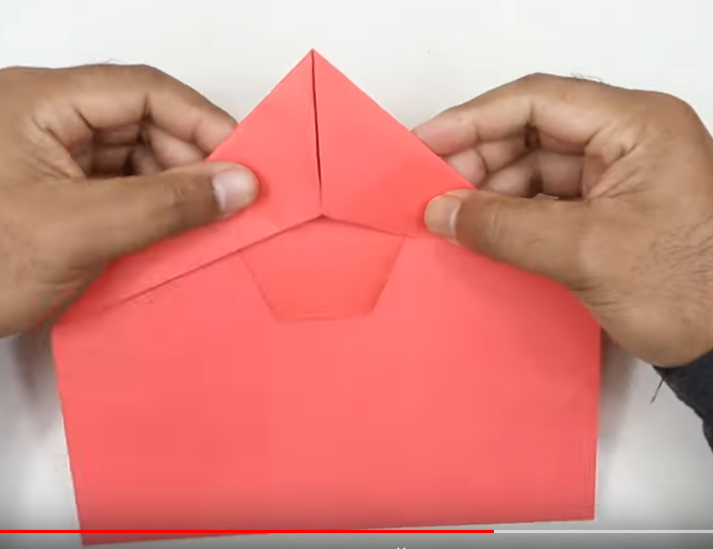  
  
7. Fold in half  
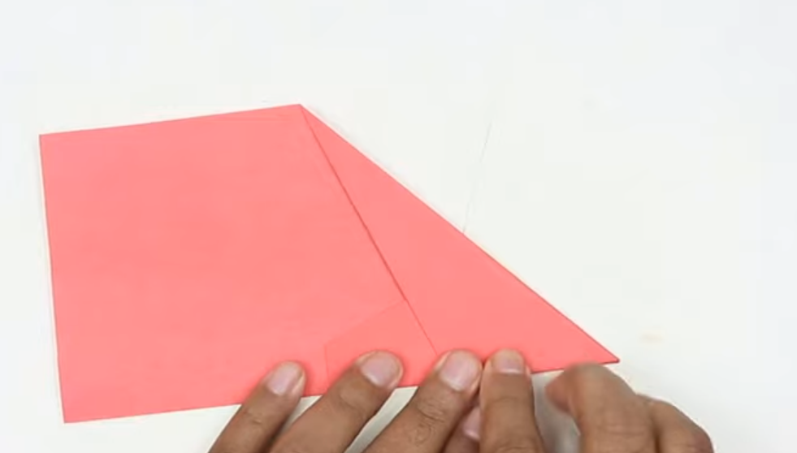  
  
8. Make wings. Start about  1 cm  from the nose and make the end of the wing just barely hide the fuselage  
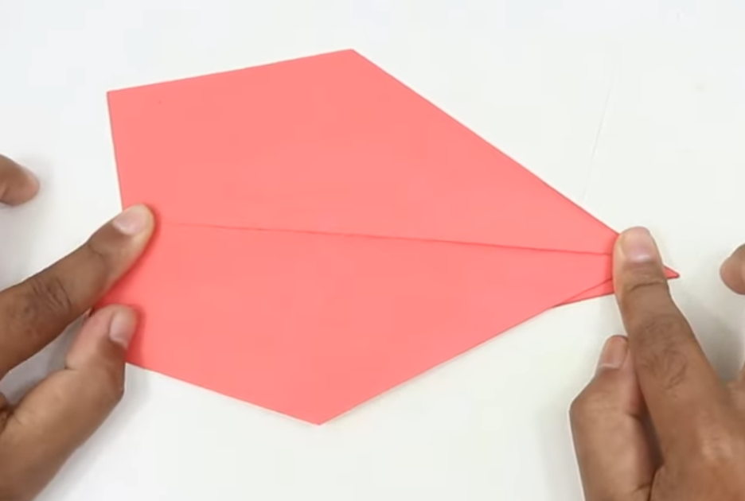  
  
  
  
9. Done!  
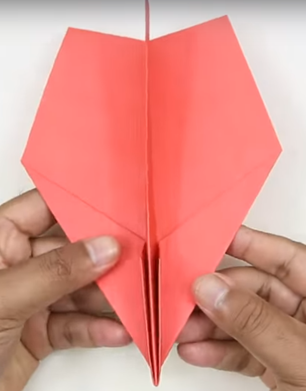  
  
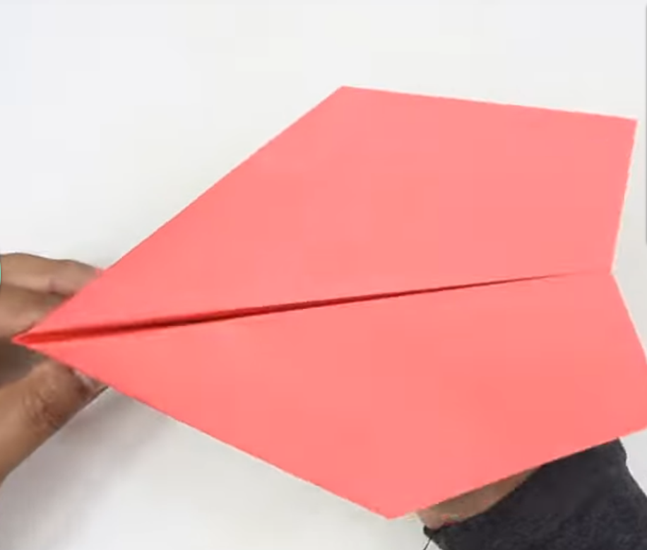  
  
  
10. Make sure to have dihedral angle about 155 at the end of the plane and about 165 at the nose